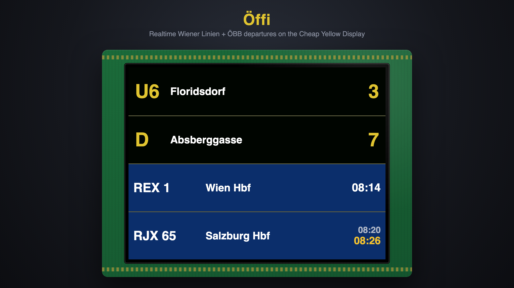

# Öffi

A real-time public-transport departure board for the **ESP32 "Cheap Yellow Display" (CYD)**.
It shows the next departures for your stops on the 2.8" screen and refreshes automatically.

Built-in data providers:

- **Wiener Linien** — Vienna trams, U-Bahn and buses (countdown in minutes)
- **ÖBB** — Austrian railways / S-Bahn (planned + real-time clock times, ÖBB board look)

Both run at once and are merged into one board, sorted by soonest departure. Adding
another transit provider is a small, well-defined job — see [Adding a provider](#adding-a-provider).

WiFi is set up **on the device** — a phone-friendly web portal with a scannable QR code,
no recompiling to change networks. Everything else (which stops to show) lives in one config file.

> "Öffi" is the Austrian/German colloquial word for public transport
> (*öffentliche Verkehrsmittel*) — trams, trains, buses, the lot.



---

## Hardware

| | |
|---|---|
| Board | ESP32 "Cheap Yellow Display" (CYD), 2.8" — sold as `ESP32-2432S028` / `185-ESP32-2.8-HuangBan` |
| MCU | ESP32-WROOM (dual-core, WiFi) |
| Display | 2.8" 240×320 SPI TFT, **ST7789** controller (some listings say ILI9341 — it is ST7789) |
| Touch | XPT2046 (present, not used yet) |

No wiring required — the display, MCU and USB-serial are all on the one board. Just a USB cable.

## Software

- [PlatformIO](https://platformio.org/) (CLI or the VS Code extension)
- Arduino framework for ESP32
- Libraries (installed automatically by PlatformIO): [TFT_eSPI](https://github.com/Bodmer/TFT_eSPI),
  [ArduinoJson](https://arduinojson.org/), [QRCode](https://github.com/ricmoo/QRCode)

All display/pin settings are passed as `build_flags` in [`platformio.ini`](platformio.ini) —
you do **not** need to edit TFT_eSPI's `User_Setup.h`.

---

## Quick start

```bash
# 1. Clone
git clone https://github.com/maikischa/Oeffi.git
cd Oeffi

# 2. Create your config from the template and choose your stops
cp src/config.example.h src/config.h
$EDITOR src/config.h          # set RBL_IDS / OEBB_STOPS — WiFi is set on-device

# 3. Build, flash and watch the serial log
pio run --target upload
pio device monitor
```

You **don't** put WiFi credentials in `config.h` — the board asks for them on first boot
(see below). After that it connects, syncs the clock over NTP, fetches departures and draws
the board.

## First boot — WiFi setup

On first boot (or whenever it has no working WiFi), the board can't reach the internet yet, so
it puts **itself** into setup mode:

1. The screen shows a **WiFi Setup** page with a **QR code** and the network name `Oeffi-Setup`.
2. On your phone, **scan the QR code** to join the `Oeffi-Setup` network automatically
   (it's an open network — no password). Or join it manually from your WiFi list.
3. A **captive-portal page opens by itself** (the same one is at `http://192.168.4.1/`).
   Pick your home network from the list, type its password, and tap **save**.
4. The board reboots, connects, and starts showing departures. Your credentials are stored in
   the ESP32's flash (NVS), so it reconnects automatically on every future boot.

**No working internet?** Some open/"free" WiFi networks (hotel, transit, café) let a device
*join* but block everything until you accept terms in a browser — which the ESP32 can't do. The
board detects this (the NTP clock never syncs) and **drops back to the WiFi Setup screen** with a
*"Kein Internet"* note, so you can pick a different network. It does **not** sit on a blank board.

### Changing WiFi later

While the board is running it serves a small config page at **`http://oeffi.local/`**
(or its IP — shown in the serial log). From there you can switch to a different network or
**forget** the current one (which reboots back into setup mode).

## Configuration

Everything that isn't WiFi lives in `src/config.h` (your private copy of `src/config.example.h`):

| Setting | Meaning |
|---|---|
| `WIFI_SSID` / `WIFI_PASS` | Optional — leave empty and use the on-device portal. Pre-seed only if you want to skip setup. ESP32 is 2.4 GHz only (no 5 GHz). |
| `MAX_ROWS` | Departures shown at once (3–4 looks best). |
| `REFRESH_INTERVAL_MS` | How often to refresh (default 30 s). |
| `WL_ENABLED`, `RBL_IDS`, `LINE_FILTER` | Wiener Linien stop(s) — find your RBL at <https://till.mabe.at/rbl/>. |
| `OEBB_ENABLED`, `OEBB_STOPS` | ÖBB station name(s), e.g. `"Wien Mitte"` — resolved to IDs automatically. |
| `OEBB_TRAINS_ONLY` | Hide bus/tram/subway at ÖBB stops. |
| `OEBB_DESTINATION` | Optional: only trains heading via this station (incl. pass-through). |

Set `WL_ENABLED`/`OEBB_ENABLED` to `0` to turn a provider off entirely.

> **Your `config.h` is git-ignored** so any credentials you *do* put there never land in a commit.

---

## How it works

Three decoupled layers handle the live board, plus a small WiFi-provisioning side:

```
main.cpp        Orchestration: WiFi connect, NTP, source registry,
                fetch → merge → sort. Falls back to setup if there's no internet.
                Knows nothing about TFT or transit APIs.

departures.*    Data layer: the DepartureSource interface and the concrete
                providers (WienerLinienSource, OebbSource) + HTTP/JSON helpers.
                Knows nothing about the display.

display.*       Presentation: owns the TFT, the palette, the row renderers and
                the WiFi-setup screen (incl. the QR). Knows nothing about the network.

portal.*        Web portal: the "Oeffi-Setup" captive portal (first run) and the
                always-on config page at oeffi.local. Persists via settings.*.

settings.*      Tiny key/value store over the ESP32's flash (NVS) — holds the
                WiFi credentials entered through the portal.
```

Each provider's `fetch()` appends normalised `Departure` records. `main.cpp` merges all
sources, sorts by countdown, and hands the list to `displayBoard()`. The only thing tying
data to presentation is `RowStyle` — an enum on each `Departure` that the display maps to a
renderer via a small dispatch table. There is no `if (provider == …)` anywhere in the UI.

### Startup flow

```
boot → load settings → WiFi credentials? ──no──► WiFi Setup screen + captive portal
                          │ yes                       (save → reboot)
                          ▼
                       connect ──fail──► (same setup screen)
                          │ ok
                          ▼
                       NTP sync ──fail──► WiFi Setup screen ("Kein Internet")
                          │ ok                (open/captive-portal WiFi → pick another)
                          ▼
                       fetch → merge → sort → draw board   (repeat every REFRESH_INTERVAL_MS)
```

### Data sources

- **Wiener Linien** uses the official OGD real-time monitor
  (`wienerlinien.at/ogd_realtime/monitor`), which returns a `countdown` directly.
- **ÖBB** uses ÖBB's own Scotty "liveticker" station board (`fahrplan.oebb.at`) — no API key,
  no proxy. Station names are resolved to IDs via the Scotty station finder, and the optional
  destination filter uses Scotty's native `dirInput` parameter. ÖBB clock times are computed
  from the board's local Vienna time, which is why a working NTP sync is required.

## Adding a provider

1. Add a `class FooSource : public DepartureSource` in `departures.h` / `departures.cpp`
   (model it on the two existing sources). In its `fetch()`, push `Departure` records and
   tag each with a `RowStyle`.
2. Add `FOO_*` settings to `config.example.h` and a `#if FOO_ENABLED` block in
   `registerSources()` in `main.cpp`.
3. Reuse an existing `RowStyle` for the row look — **or**, for a new look, add a `RowStyle`
   value, a `renderFoo()` function, and one entry in the `kRenderers[]` table in `display.cpp`.

Steps 1–2 are all you need if the new provider reuses an existing style.

## Project layout

```
platformio.ini          Board, libraries, TFT_eSPI build flags
src/
  config.example.h      Template — copy to config.h
  config.h              Your private settings (git-ignored)
  main.cpp              setup()/loop(), WiFi, NTP, source registry, setup fallback
  departures.h/.cpp     DepartureSource interface + providers + HTTP helpers
  display.h/.cpp        TFT, palette, row renderers, WiFi-setup screen + QR
  portal.h/.cpp         Captive-portal provisioning + oeffi.local config server
  settings.h/.cpp       WiFi credentials store (ESP32 flash / NVS)
CLAUDE.md               Architecture notes & gotchas for contributors
```

## Troubleshooting

- **Stuck on the WiFi Setup screen** — the network has no usable internet (often an open/
  captive-portal WiFi). Scan the QR / join `Oeffi-Setup` and pick a different network.
- **Forgot which network it's on / want to change it** — open `http://oeffi.local/` and use
  *change* or *forget WiFi*. If `oeffi.local` doesn't resolve, use the IP from the serial log.
- **Display upside-down** — change `tft.setRotation(1)` to `3` in `displayInit()` (`display.cpp`).
- **Wrong colours / mirrored** — this CYD variant is ST7789 with BGR order; the flags in
  `platformio.ini` (`ST7789_DRIVER`, `TFT_RGB_ORDER=TFT_BGR`, `TFT_INVERSION_OFF`) handle that.
- **`IO 21 is not set as GPIO` at boot** — harmless TFT_eSPI backlight message.
- **ÖBB rows missing** — the Scotty backend occasionally errors; the board degrades gracefully
  to the other providers and recovers on the next refresh.

## Contributing

Issues and pull requests are welcome — especially new transit providers. Please keep the
layer separation: no network code in `display.*`, no TFT code in `departures.*`/`portal.*`.

## License

[MIT](LICENSE) — do what you like, keep the copyright notice.

## Acknowledgements

- Inspired by [coppermilk/wiener_linien_esp32_monitor](https://github.com/coppermilk/wiener_linien_esp32_monitor).
- Wiener Linien open data (Stadt Wien) and ÖBB Scotty for the real-time data.
